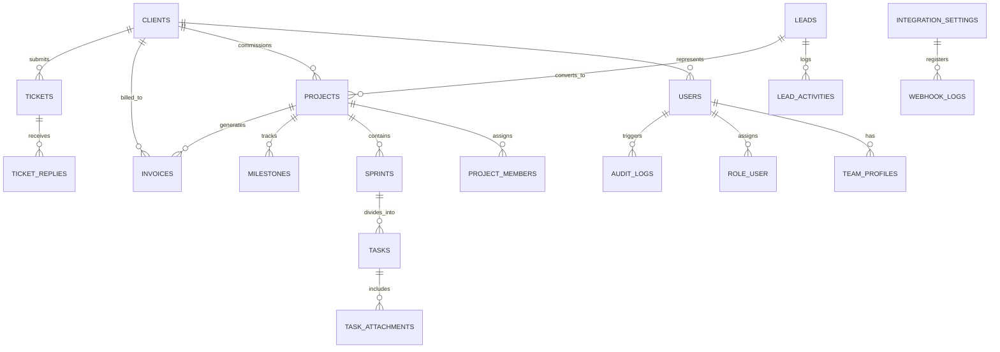
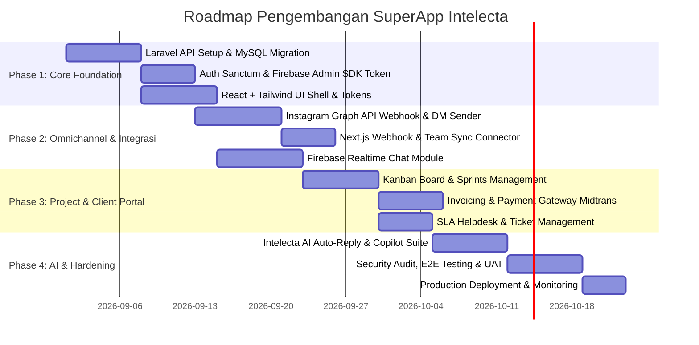

# Product Requirement Document (PRD) & Technical Specification
# Intelecta SuperApp — Enterprise Digital Operations & Omnichannel Ecosystem

> **Versi**: 1.0.0  
> **Tanggal Rilis**: 31 Agustus 2026  
> **Target Platform**: Web App (Desktop & Tablet Optimized, Mobile Responsive)  
> **Status**: Ready for Architecture & Development Phase  

---

## Daftar Isi

1. [Eksekutif & Visi Produk](#1-eksekutif--visi-produk)
2. [Tech Stack & Arsitektur Sistem](#2-tech-stack--arsitektur-sistem)
3. [User Roles, Hak Akses & Personas](#3-user-roles-hak-akses--personas)
4. [Skema Basis Data (MySQL Relational Schema)](#4-skema-basis-data-mysql-relational-schema)
5. [Arsitektur Realtime Chat & Notifikasi (Firebase SDK)](#5-arsitektur-realtime-chat--notifikasi-firebase-sdk)
6. [Integrasi Ekosistem Eksternal (Instagram & Corporate Web)](#6-integrasi-ekosistem-eksternal-instagram--corporate-web)
7. [Spesifikasi Fitur & Modul Fungsional](#7-spesifikasi-fitur--modul-fungsional)
8. [UI/UX Design System & Tata Letak Antarmuka](#8-uiux-design-system--tata-letak-antarmuka)
9. [API Contract & Webhook Specifications](#9-api-contract--webhook-specifications)
10. [Keamanan, Audit Log & Non-Functional Requirements](#10-keamanan-audit-log--non-functional-requirements)
11. [Roadmap Implementasi & Checklist Pengembangan](#11-roadmap-implementasi--checklist-pengembangan)

---

## 1. Eksekutif & Visi Produk

### 1.1 Latar Belakang & Visi
**Intelecta** adalah entitas konsultan dan penyedia solusi teknologi informasi tingkat lanjut (*Cloud Infrastructure, Enterprise AI Engineering, Custom Software, & Cybersecurity*). Seiring dengan peluncuran *Intelecta Corporate Web* (Next.js 15), dibutuhkan satu platform terpusat (**Intelecta SuperApp**) yang mengorkestrasi seluruh operasional korporat secara *end-to-end*.

**Intelecta SuperApp** dirancang sebagai sistem operasi bisnis (*Enterprise Operating Hub / SuperApp*) yang menggabungkan:
1. **Omnichannel Communication Center**: Penyatuan pesan masuk & notifikasi dari Instagram Direct Message (Meta Graph API), formulir kontak & terminal pada Corporate Web, WhatsApp Business, dan internal chat.
2. **Client Portal & B2B Workspace**: Area kolaborasi interaktif untuk klien korporat (pemantauan milestone proyek, deliverable, SLA helpdesk, tagihan/invoicing, dan secure document vault).
3. **Internal Project & Talent Management**: Manajemen alokasi engineer/konsultan, sprint tracking, otomatisasi sinkronisasi profil publik ke halaman `/tim/[slug]` pada Corporate Web.
4. **Realtime Chat & Incident Escalation**: Komunikasi instan berbasis Firebase Realtime / Firestore & Push Notifications (FCM) untuk koordinasi cepat antar tim dan klien.

```
                    ┌────────────────────────────────────────┐
                    │      INTELECTA CORPORATE WEB (Next.js) │
                    │   (Showcase, Contact Form, /tim, CLI)  │
                    └───────────────────┬────────────────────┘
                                        │ Webhook / REST Sync
                                        ▼
┌──────────────────┐    ┌───────────────────────────────────┐    ┌──────────────────┐
│  INSTAGRAM /     │───▶│       INTELECTA SUPERAPP          │◀───│   B2B CLIENTS    │
│  META GRAPH API  │    │     (Laravel + React + MySQL)     │    │ (Portal & Chat)  │
└──────────────────┘    └─────────────────┬─────────────────┘    └──────────────────┘
                                          │
                     ┌────────────────────┴────────────────────┐
                     ▼                                         ▼
        ┌─────────────────────────┐               ┌─────────────────────────┐
        │  FIREBASE REALTIME SDK  │               │   INTERNAL EMPLOYEES    │
        │ (Chat, Presence, FCM)   │               │ (PM, Engineers, Finance)│
        └─────────────────────────┘               └─────────────────────────┘
```

---

## 2. Tech Stack & Arsitektur Sistem

### 2.1 Ringkasan Teknologi

| Layer | Teknologi | Versi | Peran & Justifikasi |
| :--- | :--- | :--- | :--- |
| **Backend Framework** | **Laravel** | 11.x (PHP 8.3+) | REST API Core, Business Logic, Webhooks Dispatcher, Queues (Redis), Auth (Sanctum/JWT), Spatie RBAC |
| **Frontend Framework** | **React** + **Vite** / **Inertia.js** | React 18/19 | SPA dinamis, state management terpusat, modularitas tinggi, fast build time |
| **Styling & UI** | **Tailwind CSS** + **Shadcn/Radix UI** | Tailwind v3.4+ | Monochromatic dark theme tokens (`#030303`, `#0D0D11`), glassmorphism, konsistensi token dengan Corporate Web |
| **Database** | **MySQL** | 8.0+ | Relational data integrity, ACID transactions untuk billing & kontrak, JSON fields untuk konfigurasi dinamis |
| **Realtime Engine** | **Firebase SDK** | 10.x+ (Client & Admin) | Realtime chat channels, Firestore/Realtime DB sync, Firebase Cloud Messaging (FCM) push notifications |
| **Queue & Cache** | **Redis** | 7.x | Asynchronous webhook processing (Instagram & Web), rate limiting, fast caching |
| **Icons & Animasi** | **Lucide React** + **Framer Motion** | — | Visual interface interaktif dan konsisten |

### 2.2 Struktur Arsitektur Monorepo / Decoupled

```
SuperAppIntelecta/
├── backend/                  # Laravel 11 API Backend
│   ├── app/
│   │   ├── Http/Controllers/API/ (V1 Controllers)
│   │   ├── Models/           (Eloquent Models & Scopes)
│   │   ├── Services/         (InstagramService, FirebaseService, WebhookService)
│   │   ├── Jobs/             (ProcessInstagramWebhook, SendFCMNotification)
│   │   └── Events/           (LeadReceivedEvent, ProjectUpdatedEvent)
│   ├── routes/api.php        (Protected & Public Webhook Endpoints)
│   └── config/services.php   (Firebase & Meta API Config)
│
├── frontend/                 # React + Tailwind SPA
│   ├── src/
│   │   ├── assets/           (Logos, Icons, Badges)
│   │   ├── components/       (Shadcn UI, Custom Bento Cards, Glass Modals)
│   │   │   ├── layout/       (Sidebar, Header, Omnichannel Drawer, Floating Bar)
│   │   │   ├── chat/         (Firebase Chat Stream, Message Bubble, Attachment)
│   │   │   ├── projects/     (Kanban, Gantt, Milestone Timeline)
│   │   │   └── leads/        (Instagram Lead Inbox, Corporate Web Submissions)
│   │   ├── hooks/            (useFirebaseAuth, useRealtimeChat, useFCM)
│   │   ├── contexts/         (AuthContext, NotificationContext, ThemeContext)
│   │   └── pages/            (Dashboard, Omnichannel, Clients, Projects, Settings)
│   └── tailwind.config.js
└── docs/                     # Dokumentasi API & Schema
```

---

## 3. User Roles, Hak Akses & Personas

Sistem menggunakan **Role-Based Access Control (RBAC)** berbasis library *Spatie Laravel-Permission*.

```
                              ┌────────────────────┐
                              │    SUPER ADMIN     │
                              │  (Direksi & CEO)   │
                              └─────────┬──────────┘
                                        │
           ┌────────────────────────────┼────────────────────────────┐
           ▼                            ▼                            ▼
┌────────────────────┐       ┌────────────────────┐       ┌────────────────────┐
│  PROJECT MANAGER   │       │   LEAD ENGINEER    │       │ FINANCE / ACCOUNT  │
│ (Proyek, Task, SLA)│       │ (Dev, Sprint, Code)│       │ (Billing, Invoices)│
└──────────┬─────────┘       └──────────┬─────────┘       └──────────┬─────────┘
           │                            │                            │
           └────────────────────────────┼────────────────────────────┘
                                        │
           ┌────────────────────────────┴────────────────────────────┐
           ▼                                                         ▼
┌────────────────────┐                                    ┌────────────────────┐
│ MARKETING & SALES  │                                    │    B2B CLIENTS     │
│(IG Leads, Web Form)│                                    │(Portal & Proyek SLA│
└────────────────────┘                                    └────────────────────┘
```

### 3.1 Matriks Otorisasi Fitur

| Modul / Fitur | Super Admin | Project Manager | Lead Engineer | Marketing / Sales | Finance | B2B Client |
| :--- | :---: | :---: | :---: | :---: | :---: | :---: |
| **Global Analytics & P&L** | ✅ Read/Write | ❌ No Access | ❌ No Access | ❌ No Access | ✅ Read Only | ❌ No Access |
| **Instagram Lead Inbox** | ✅ Full | ✅ Read/Assign | ❌ No Access | ✅ Full/Respond | ❌ No Access | ❌ No Access |
| **Web Contact & CLI Inquiries** | ✅ Full | ✅ Read/Assign | ❌ No Access | ✅ Full/Respond | ❌ No Access | ❌ No Access |
| **Project & Sprint Kanban** | ✅ Full | ✅ Full | ✅ Manage Tasks | 👁️ Read Milestone | ❌ No Access | 👁️ View Milestone |
| **Talent & `/tim` Sync** | ✅ Full | ✅ Read/Assign | 👁️ Profile Edit | ❌ No Access | ❌ No Access | ❌ No Access |
| **Invoicing & Billing Gateway** | ✅ Full | 👁️ View PO | ❌ No Access | ❌ No Access | ✅ Full | 💳 Pay / View |
| **Firebase Realtime Chat** | ✅ All Channels | ✅ Project Channels | ✅ Dev Channels | ✅ Lead Channels | ❌ No Access | 💬 Client Room |
| **Helpdesk & SLA Tickets** | ✅ Full | ✅ Full | ✅ Resolve Ticket | ❌ No Access | ❌ No Access | 🎫 Create Ticket |

---

## 4. Skema Basis Data (MySQL Relational Schema)

### 4.1 Entitas Utama & Relasi (ERD)



### 4.2 Spesifikasi Kolom Tabel MySQL

#### 1. Tabel `users` & `team_profiles`
Menyimpan kredensial sistem, profil internal, serta metadata untuk disinkronkan langsung ke halaman `/tim/[slug]` di Corporate Web.

```sql
CREATE TABLE `users` (
  `id` BIGINT UNSIGNED AUTO_INCREMENT PRIMARY KEY,
  `uuid` CHAR(36) NOT NULL UNIQUE,
  `name` VARCHAR(255) NOT NULL,
  `email` VARCHAR(255) NOT NULL UNIQUE,
  `password` VARCHAR(255) NOT NULL,
  `phone` VARCHAR(30) NULL,
  `role` ENUM('super_admin', 'project_manager', 'engineer', 'marketing', 'finance', 'client') NOT NULL DEFAULT 'engineer',
  `avatar_url` VARCHAR(500) NULL,
  `status` ENUM('active', 'suspended', 'inactive') DEFAULT 'active',
  `firebase_uid` VARCHAR(128) NULL UNIQUE,
  `fcm_token` TEXT NULL,
  `last_active_at` TIMESTAMP NULL,
  `created_at` TIMESTAMP DEFAULT CURRENT_TIMESTAMP,
  `updated_at` TIMESTAMP DEFAULT CURRENT_TIMESTAMP ON UPDATE CURRENT_TIMESTAMP
) ENGINE=InnoDB DEFAULT CHARSET=utf8mb4 COLLATE=utf8mb4_unicode_ci;

CREATE TABLE `team_profiles` (
  `id` BIGINT UNSIGNED AUTO_INCREMENT PRIMARY KEY,
  `user_id` BIGINT UNSIGNED NOT NULL,
  `slug` VARCHAR(255) NOT NULL UNIQUE,          -- sync ke /tim/[slug]
  `job_title` VARCHAR(255) NOT NULL,            -- e.g. "Principal AI Engineer"
  `tagline` VARCHAR(255) NULL,
  `bio_id` TEXT NULL,                           -- Bio Bahasa Indonesia
  `skills_json` JSON NOT NULL,                  -- ["PyTorch", "Kubernetes", "Next.js"]
  `certifications_json` JSON NULL,              -- [{"name": "AWS Certified Pro", "badge_url": "..."}]
  `social_links_json` JSON NULL,                -- {"linkedin": "...", "github": "..."}
  `is_public_showcase` BOOLEAN DEFAULT TRUE,    -- Tampil di Corporate Web atau tidak
  `display_order` INT DEFAULT 0,
  `created_at` TIMESTAMP DEFAULT CURRENT_TIMESTAMP,
  `updated_at` TIMESTAMP DEFAULT CURRENT_TIMESTAMP ON UPDATE CURRENT_TIMESTAMP,
  FOREIGN KEY (`user_id`) REFERENCES `users`(`id`) ON DELETE CASCADE
) ENGINE=InnoDB DEFAULT CHARSET=utf8mb4 COLLATE=utf8mb4_unicode_ci;
```

#### 2. Tabel `clients` & `projects`
Mengelola portofolio klien korporat B2B, nilai kontrak, status pengerjaan, dan alokasi tim.

```sql
CREATE TABLE `clients` (
  `id` BIGINT UNSIGNED AUTO_INCREMENT PRIMARY KEY,
  `company_name` VARCHAR(255) NOT NULL,
  `industry` VARCHAR(100) NULL,
  `primary_contact_user_id` BIGINT UNSIGNED NOT NULL,
  `address` TEXT NULL,
  `website` VARCHAR(255) NULL,
  `tax_id` VARCHAR(100) NULL,                   -- NPWP / Tax Reg
  `created_at` TIMESTAMP DEFAULT CURRENT_TIMESTAMP,
  FOREIGN KEY (`primary_contact_user_id`) REFERENCES `users`(`id`)
) ENGINE=InnoDB DEFAULT CHARSET=utf8mb4 COLLATE=utf8mb4_unicode_ci;

CREATE TABLE `projects` (
  `id` BIGINT UNSIGNED AUTO_INCREMENT PRIMARY KEY,
  `client_id` BIGINT UNSIGNED NOT NULL,
  `project_code` VARCHAR(50) NOT NULL UNIQUE,   -- e.g. "INTL-2026-008"
  `title` VARCHAR(255) NOT NULL,
  `category` ENUM('ai_engineering', 'cloud_infra', 'cybersecurity', 'custom_software') NOT NULL,
  `status` ENUM('scoping', 'active_sprint', 'uat', 'maintenance', 'completed') DEFAULT 'scoping',
  `contract_value` DECIMAL(15,2) NOT NULL DEFAULT 0.00,
  `start_date` DATE NULL,
  `target_completion_date` DATE NULL,
  `git_repository_url` VARCHAR(500) NULL,
  `staging_url` VARCHAR(500) NULL,
  `production_url` VARCHAR(500) NULL,
  `is_featured_case_study` BOOLEAN DEFAULT FALSE, -- Ditampilkan di Showcase Web?
  `case_study_metrics_json` JSON NULL,            -- {"uptime": "99.99%", "perf": "+45%"}
  `created_at` TIMESTAMP DEFAULT CURRENT_TIMESTAMP,
  `updated_at` TIMESTAMP DEFAULT CURRENT_TIMESTAMP ON UPDATE CURRENT_TIMESTAMP,
  FOREIGN KEY (`client_id`) REFERENCES `clients`(`id`) ON DELETE CASCADE
) ENGINE=InnoDB DEFAULT CHARSET=utf8mb4 COLLATE=utf8mb4_unicode_ci;
```

#### 3. Tabel `leads` & `omnichannel_interactions`
Menampung prospek dari Instagram Graph Webhook, Form Kontak Corporate Web, dan Terminal CLI.

```sql
CREATE TABLE `leads` (
  `id` BIGINT UNSIGNED AUTO_INCREMENT PRIMARY KEY,
  `source` ENUM('instagram_dm', 'instagram_comment', 'web_contact_form', 'web_terminal_cli', 'whatsapp', 'manual') NOT NULL,
  `external_sender_id` VARCHAR(255) NULL,       -- IG Scoped ID / Web Session UUID
  `sender_name` VARCHAR(255) NOT NULL,
  `sender_contact` VARCHAR(255) NULL,           -- Email / Phone / IG Handle
  `company_name` VARCHAR(255) NULL,
  `subject_or_intent` VARCHAR(255) NULL,
  `initial_message` TEXT NOT NULL,
  `status` ENUM('new', 'qualified', 'pitching', 'converted_to_project', 'dropped') DEFAULT 'new',
  `assigned_to_user_id` BIGINT UNSIGNED NULL,
  `ai_sentiment_score` DECIMAL(3,2) NULL,       -- Skor analisis sentimen AI Intelecta
  `ai_suggested_reply` TEXT NULL,
  `metadata_json` JSON NULL,                    -- Raw webhook payload (IG message_id, IP, browser, CLI commands)
  `created_at` TIMESTAMP DEFAULT CURRENT_TIMESTAMP,
  `updated_at` TIMESTAMP DEFAULT CURRENT_TIMESTAMP ON UPDATE CURRENT_TIMESTAMP,
  FOREIGN KEY (`assigned_to_user_id`) REFERENCES `users`(`id`) ON DELETE SET NULL
) ENGINE=InnoDB DEFAULT CHARSET=utf8mb4 COLLATE=utf8mb4_unicode_ci;
```

#### 4. Tabel `invoices` & `tickets` (Finance & SLA Support)

```sql
CREATE TABLE `invoices` (
  `id` BIGINT UNSIGNED AUTO_INCREMENT PRIMARY KEY,
  `invoice_number` VARCHAR(50) NOT NULL UNIQUE, -- e.g. "INV/2026/08/0012"
  `client_id` BIGINT UNSIGNED NOT NULL,
  `project_id` BIGINT UNSIGNED NULL,
  `amount` DECIMAL(15,2) NOT NULL,
  `tax_amount` DECIMAL(15,2) NOT NULL DEFAULT 0.00,
  `total_payable` DECIMAL(15,2) NOT NULL,
  `due_date` DATE NOT NULL,
  `payment_status` ENUM('unpaid', 'pending_gateway', 'paid', 'overdue', 'cancelled') DEFAULT 'unpaid',
  `payment_gateway_ref` VARCHAR(255) NULL,      -- Midtrans/Xendit Transaction ID
  `paid_at` TIMESTAMP NULL,
  `created_at` TIMESTAMP DEFAULT CURRENT_TIMESTAMP,
  FOREIGN KEY (`client_id`) REFERENCES `clients`(`id`),
  FOREIGN KEY (`project_id`) REFERENCES `projects`(`id`)
) ENGINE=InnoDB DEFAULT CHARSET=utf8mb4 COLLATE=utf8mb4_unicode_ci;

CREATE TABLE `tickets` (
  `id` BIGINT UNSIGNED AUTO_INCREMENT PRIMARY KEY,
  `ticket_code` VARCHAR(50) NOT NULL UNIQUE,    -- e.g. "TCK-8821"
  `client_id` BIGINT UNSIGNED NOT NULL,
  `project_id` BIGINT UNSIGNED NOT NULL,
  `creator_user_id` BIGINT UNSIGNED NOT NULL,
  `title` VARCHAR(255) NOT NULL,
  `priority` ENUM('low', 'medium', 'high', 'critical_sla_1hr') DEFAULT 'medium',
  `status` ENUM('open', 'investigating', 'resolved', 'closed') DEFAULT 'open',
  `assigned_engineer_id` BIGINT UNSIGNED NULL,
  `resolution_notes` TEXT NULL,
  `created_at` TIMESTAMP DEFAULT CURRENT_TIMESTAMP,
  `resolved_at` TIMESTAMP NULL,
  FOREIGN KEY (`client_id`) REFERENCES `clients`(`id`),
  FOREIGN KEY (`project_id`) REFERENCES `projects`(`id`),
  FOREIGN KEY (`creator_user_id`) REFERENCES `users`(`id`),
  FOREIGN KEY (`assigned_engineer_id`) REFERENCES `users`(`id`)
) ENGINE=InnoDB DEFAULT CHARSET=utf8mb4 COLLATE=utf8mb4_unicode_ci;
```

---

## 5. Arsitektur Realtime Chat & Notifikasi (Firebase SDK)

### 5.1 Integrasi Hybrid Laravel + Firebase SDK
- **Autentikasi**: Laravel mengautentikasi pengguna via API Token (Sanctum). Saat login berhasil, backend Laravel menggunakan **Firebase Admin SDK** untuk menghasilkan *Firebase Custom Token* berbasis `uuid` user.
- **Frontend Sync**: Frontend React menginisialisasi Firebase SDK (`signInWithCustomToken()`) dan langsung terhubung dengan Firestore / Realtime DB untuk mendengarkan perubahan stream chat secara instan (*sub-100ms latency*).

```
   [ User Login in React ]
             │
             ▼
   [ POST /api/v1/auth/login ] ─────────▶ [ Laravel Controller ]
                                                 │
                                                 ▼ (Generate Custom Token)
                                          [ Firebase Admin SDK ]
                                                 │
   [ Return Bearer Token + Firebase Token ] ◀────┘
             │
             ▼
   [ React initializes Firebase Client SDK ]
             │
             ▼
   [ Direct Realtime Listeners to Firestore: /channels/{channelId}/messages ]
```

### 5.2 Skema Struktur Firestore NoSQL untuk Chat

```
firestore_root/
├── channels/                          # Collection
│   └── {channelId}/                   # Doc (e.g., "proj_INTL-2026-008" atau "lead_ig_99218")
│       ├── type: "project" | "direct" | "lead_omnichannel"
│       ├── name: "FinTech Core Migration"
│       ├── participants: ["uuid_user_1", "uuid_user_2", "client_uuid"]
│       ├── last_message: "Patch deployment v2.1 sukses dilaksanakan."
│       ├── last_message_at: Timestamp
│       ├── unread_counts: { "uuid_user_1": 0, "client_uuid": 2 }
│       │
│       └── messages/                  # Sub-collection
│           └── {messageId}/           # Doc
│               ├── sender_id: "uuid_user_1"
│               ├── sender_name: "Rian (Principal Architect)"
│               ├── sender_avatar: "https://..."
│               ├── text: "Semua service Kafka sudah green."
│               ├── attachments: [
│               │     { "type": "image", "url": "https://...", "filename": "chart.png" }
│               │   ]
│               ├── is_internal_note: false  # Fitur pesan rahasia khusus internal dev
│               └── created_at: Timestamp
│
└── presence/                          # Collection (Status Online/Typing)
    └── {userId}/                      # Doc
        ├── status: "online" | "away" | "offline"
        ├── typing_in_channel: "proj_INTL-2026-008" | null
        └── last_seen: Timestamp
```

### 5.3 Push Notifications (Firebase Cloud Messaging / FCM)
- **Background Dispatcher**: Setiap pesan masuk baru atau perubahan status tiket dengan prioritas `critical_sla_1hr` memicu Laravel Event Listener `SendFCMNotificationJob`.
- **Target**: Device web browser engineer yang sedang bertugas dan perangkat mobile manajer terkait.
- **Audio Alert**: Sound alert monoline modern khusus di antarmuka web saat ada inquiry Instagram atau lead baru dari Corporate Web.

---

## 6. Integrasi Ekosistem Eksternal (Instagram & Corporate Web)

### 6.1 Integrasi Instagram (Meta Graph API)

```
[ Instagram User ] ──( Kirim DM / Komentar )──▶ [ Instagram / Meta Server ]
                                                        │
                                                        ▼ (Webhook Event POST)
                                           [ Laravel: POST /api/webhooks/instagram ]
                                                        │
                                                        ├── 1. Validasi X-Hub-Signature-256
                                                        ├── 2. Simpan Lead & Pesan ke MySQL
                                                        ├── 3. Sync ke Firestore Channel
                                                        └── 4. Trigger FCM Notification ke Tim Sales
```

#### Alur Teknis:
1. **Webhook Registration**: Endpoint `https://superapp.intelecta.id/api/webhooks/instagram` diverifikasi via `hub.challenge` dan secret token.
2. **Payload Parsing**: Menangkap payload event `messages`, `messaging_postbacks`, dan `comments`.
3. **Conversational Sync**: Jika pengirim belum ada di tabel `leads`, buat lead baru berkategori `instagram_dm`. Jika sudah ada, tambahkan pesan ke thread obrolan omnichannel yang sama.
4. **Balas dari SuperApp**: Tim sales/engineer dapat membalas pesan langsung dari antarmuka SuperApp. Backend Laravel akan mengeksekusi `POST https://graph.facebook.com/v19.0/me/messages` dengan token akses resmi.

### 6.2 Integrasi Corporate Web (Next.js 15)

Corporate Web dan SuperApp terhubung secara dua arah (*Bi-directional Data & Action Pipeline*):

| Titik Integrasi | Arah Aliran | Mekanisme Teknis | Deskripsi Fungsional |
| :--- | :---: | :--- | :--- |
| **Contact Form Submissions** | Next.js ➔ SuperApp | Secure API Key + Webhook POST | Setiap visitor yang mengisi form kontak di landing page langsung masuk ke dashboard SuperApp sebagai Lead baru. |
| **Terminal CLI Interactions** | Next.js ➔ SuperApp | Lightweight Analytics Beacon | Riwayat command visitor di terminal interaktif (`services`, `contact`, `team`) di-stream untuk menangkap *user intent*. |
| **Team Profiles (`/tim`)** | SuperApp ➔ Next.js | On-Demand ISR Revalidation | Edit profil engineer (foto, bio, keahlian) di SuperApp langsung memicu *Next.js Revalidation Tag* (`revalidatePath('/tim/[slug]')`). |
| **Case Studies Showcase** | SuperApp ➔ Next.js | JSON API Feed | Proyek yang ditandai `is_featured_case_study = true` otomatis disajikan pada section Case Studies landing page. |

---

## 7. Spesifikasi Fitur & Modul Fungsional

### 7.1 Modul 1: Omnichannel Communication Command Center
- **Unified Inbox**: Tab terpadu untuk menyaring pesan masuk dari Instagram DM, Web Form, Terminal CLI, dan WhatsApp.
- **AI-Powered Quick Response**: Memberikan saran balasan cerdas otomatis (*LLM Inference*) berdasarkan ringkasan portofolio layanan Intelecta.
- **Conversion Trigger**: 1-Click action untuk mengubah inquiry chat menjadi `Proyek Resmi` dan otomatis men-generate akun portal klien.

### 7.2 Modul 2: Client & Project Command Center (B2B Workspace)
- **Milestone & Sprint Tracker**: Tampilan interaktif Gantt chart & Kanban board (Scrum/Agile style).
- **Deliverable & Asset Vault**: Penyimpanan dokumen arsitektur, NDA, OpenAPI swagger spec, dan file build yang aman.
- **Realtime Activity Log**: Jejak commit Git, deployment pipeline status, dan pengujian server live.

### 7.3 Modul 3: Financial, Retainer & Invoicing Hub
- **Automated Invoicing**: Pembuatan invoice otomatis dengan format penomoran profesional PDF (`INV/2026/...`).
- **Payment Gateway Integration**: Tombol bayar instan (Virtual Account, QRIS, Credit Card) terintegrasi Midtrans / Xendit.
- **Revenue & Contract Run-Rate**: Grafik proyeksi cashflow dan realisasi SLA retainer bulanan.

### 7.4 Modul 4: Talent, Resource & Corporate Web Sync
- **Workload Matrix**: Dashboard kapasitas engineer (siapa yang sedang mengerjakan sprint aktif, siapa yang berstatus *idle* atau *available for consultation*).
- **Public Profile Editor**: Form WYSIWYG untuk mengatur tampilan halaman pribadi engineer di `/tim/[slug]` Corporate Web dengan preview langsung.

### 7.5 Modul 5: SLA Ticketing & Incident Management
- **Tiered SLA Alerts**: Countdown timer berbasis tingkat keparahan (contoh: P1 Critical = 60 menit respon wajib).
- **Root Cause Analysis (RCA) Logger**: Form pelaporan insiden pasca penyelesaian masalah untuk keperluan transparansi ke klien.

---

## 8. UI/UX Design System & Tata Letak Antarmuka

### 8.1 Filosofi Visual (Monochromatic Dark Obsidian)
Antarmuka SuperApp mengadopsi bahasa visual yang selaras dengan *Intelecta Corporate Web*:
- **Background Utama**: Rich Pitch Black (`#030303`) dan Deep Obsidian Surface (`#0D0D11`).
- **Accent & Highlights**: Silver Glow gradient (`#FFFFFF` ➔ `#71717A`) dengan border ultra tipis `rgba(255, 255, 255, 0.08)`.
- **Typography**: `Space Grotesk` untuk judul modul dan metrik penting; `Inter` untuk tabel, form, dan teks obrolan; `JetBrains Mono` untuk kode tiket, JSON inspector, dan stack tags.

### 8.2 Layout Wireframe & Struktur Komponen

```
┌────────────────────────────────────────────────────────────────────────────────────────┐
│ [LOGO] INTELECTA OS     [🔍 Cmd+K Search...]           [⚡ Systems: 99.99%] [🔔(3)] [👤] │
├──────────────┬─────────────────────────────────────────────────────────┬───────────────┤
│ 📁 NAVIGASI  │ 📊 AREA KONTEN UTAMA (Dynamic Workspace Tabs)           │ 💬 CHAT TRAY  │
│              │ ┌─────────────────────────────────────────────────────┐ │               │
│ • Dashboard  │ │ 🏷️ PROYEK: FinTech Core Banking Migration           │ │ # INTL-008    │
│ • Omnichannel│ ├─────────────────────────────────────────────────────┤ │               │
│   - IG Leads │ │ [Sprint 4] [Milestones] [Documents] [Invoices] [SLA]│ │ Rian (Lead):  │
│   - Web Form │ │                                                     │ │ Deployment    │
│ • Proyek     │ │  KANBAN SPRINT TRACKER:                             │ │ sudah live di │
│ • Klien      │ │  ┌───────────┐ ┌───────────┐ ┌───────────┐         │ │ staging! 🚀   │
│ • Finansial  │ │  │ TO DO (3) │ │IN PROGRESS│ │ DONE (14) │         │ │ 12:44 PM      │
│ • Tim (/tim) │ │  │ [Card...] │ │ [Card...] │ │ [Card...] │         │ │               │
│ • Helpdesk   │ │  └───────────┘ └───────────┘ └───────────┘         │ │ [Type msg...] │
│ • Settings   │ └─────────────────────────────────────────────────────┘ │ [📎] [Send]   │
└──────────────┴─────────────────────────────────────────────────────────┴───────────────┘
```

### 8.3 Fitur Interaktif Khusus
- **Command Palette (`Cmd + K` / `Ctrl + K`)**: Navigasi cepat tanpa mouse ke seluruh proyek, klien, tiket, atau fungsi Instagram DM.
- **Glassmorphic Quick Chat Drawer**: Tab percakapan yang dapat di-minimize ke bar bawah atau di-pin di samping layar kerja.
- **Live Status Indicator**: Pulse dot hijau realtime yang mendeteksi konektivitas WebSocket / Firebase.

---

## 9. API Contract & Webhook Specifications

### 9.1 Endpoint REST API Kunci (Laravel Backend)

| HTTP Method | Route | Fungsi & Deskripsi |
| :--- | :--- | :--- |
| `POST` | `/api/v1/auth/login` | Autentikasi user, menghasilkan Laravel Sanctum Token & Firebase Custom Token. |
| `GET` | `/api/v1/omnichannel/leads` | Mengambil daftar lead masuk dari Instagram, Web Form, dan WhatsApp beserta filter status. |
| `POST` | `/api/v1/omnichannel/instagram/reply` | Mengirim pesan balasan langsung ke Instagram Direct Message via Graph API. |
| `POST` | `/api/webhooks/instagram` | Receiver webhook resmi dari Meta Platform (menangkap event message & comment). |
| `POST` | `/api/webhooks/corporate-web` | Menerima payload lead kontak atau interaksi terminal dari Next.js Corporate Web. |
| `POST` | `/api/v1/team/sync-public-profile` | Memperbarui profil engineer dan memicu revalidasi instan ke Corporate Web. |
| `GET` | `/api/v1/projects/{uuid}/board` | Mengambil hierarki sprint, kanban card, dan progres milestone proyek. |
| `POST` | `/api/v1/invoices/{uuid}/generate-payment`| Membuat tautan pembayaran instan (Payment Gateway Snap URL). |

### 9.2 Contoh Payload Webhook (Corporate Web ➔ SuperApp)

```json
{
  "event": "lead.contact_form_submitted",
  "timestamp": 1788172800,
  "data": {
    "sender_name": "Budi Santoso",
    "sender_email": "budi@enterprisebank.co.id",
    "company": "Bank Nusantara Mandiri",
    "service_interest": "ai_engineering",
    "message": "Kami membutuhkan integrasi LLM lokal on-premise untuk analisis dokumen kepatuhan kredit.",
    "source_ip": "103.28.12.44",
    "user_agent": "Mozilla/5.0 ... Chrome/128.0"
  },
  "signature": "sha256=d8e8fca2dc6b..."
}
```

---

## 10. Keamanan, Audit Log & Non-Functional Requirements

### 10.1 Protokol Keamanan & Enkripsi
1. **Webhook Signature Verification**: Setiap payload dari Meta dan Corporate Web divalidasi dengan enkripsi HMAC SHA-256 menggunakan secret key khusus.
2. **Data Encryption at Rest & in Transit**: Seluruh komunikasi wajib HTTPS/TLS 1.3. Kredensial sensitif dan token integrasi disimpan menggunakan enkripsi `AES-256-CBC` via Laravel `Crypt`.
3. **Granular Audit Logs**: Setiap aktivitas krusial (perubahan nilai invoice, akses repositori proyek, perubahan hak akses user) dicatat dalam tabel `audit_logs` dengan informasi IP, Timestamp, dan State Diff.

### 10.2 Standar Kinerja & SLA Sistem
- **API Response Time**: < 150ms untuk endpoint data transaksional.
- **Chat Delivery Latency**: < 100ms via Firebase Realtime infrastructure.
- **High Availability**: Target uptime sistem 99.95% dengan backup otomatis database harian ke S3 Object Storage.

---

## 11. Roadmap Implementasi & Checklist Pengembangan



### 11.1 Checklist Langkah Pengerjaan

#### Tahap 1: Setup Fondasi & Otentikasi
- [ ] Inisialisasi project Laravel 11 dengan MySQL database driver.
- [ ] Buat skema migrasi MySQL (`users`, `team_profiles`, `clients`, `projects`, `leads`, `invoices`, `tickets`).
- [ ] Konfigurasi Spatie Laravel-Permission untuk manajemen role dan hak akses.
- [ ] Setup Firebase Project, download `service-account.json`, dan implementasikan Custom Token Generator.
- [ ] Inisialisasi React frontend dengan Tailwind CSS dan rancang theme token Monochromatic Dark.

#### Tahap 2: Komunikasi Realtime & Integrasi Eksternal
- [ ] Buat listener webhook `/api/webhooks/instagram` dan handler verifikasi token Meta.
- [ ] Bangun modul pengirim DM Instagram dari backend ke Meta Graph API.
- [ ] Implementasikan endpoint penerima webhook dari Next.js Corporate Web.
- [ ] Bangun komponen UI chat di React terhubung ke Firebase Firestore untuk streaming pesan instan.
- [ ] Pasang web push notifications (FCM) untuk notifikasi pesan masuk dan insiden darurat.

#### Tahap 3: Modul Operasional & Portal Bisnis
- [ ] Bangun Kanban board interaktif untuk manajemen sprint proyek engineer.
- [ ] Buat Client Portal yang menampilkan status proyek, dokumen kontrak, dan tombol ticketing.
- [ ] Integrasikan payment gateway untuk tagihan invoice digital.
- [ ] Buat modul Talent Manager yang dapat memicu webhook revalidasi profil ke `/tim/[slug]` di Corporate Web.

#### Tahap 4: Pengujian, Optimasi & Peluncuran
- [ ] Pengujian performa realtime chat di bawah beban multi-channel concurrent.
- [ ] Uji coba simulasi webhook Instagram DM dan form submission landing page.
- [ ] Setup cron job & queue worker Redis di server untuk background tasks.
- [ ] Deployment ke environment staging dan verifikasi kepatuhan keamanan.

---

> **Dokumen Terkait**:
> - [INTELECTA_PRD.md (Corporate Web)](file:///c:/laragon/www/Intelecta/Refrence/INTELECTA_PRD.md)
> - File Spesifikasi API Swagger / OpenAPI (akan di-generate pada tahap implementasi)
